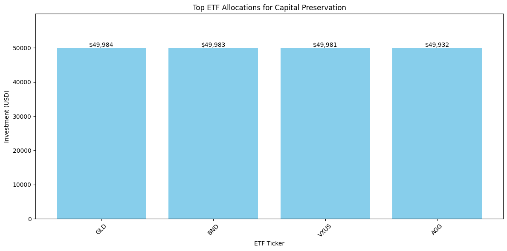

# Capital Preservation Allocation Using Linear Programming

## Overview
This project demonstrates the use of **Linear Programming (LP)** to optimize the allocation of $250,000 across 25 ETFs, prioritizing **capital preservation** and achieving a **minimum annual return of 2%**. The model minimizes risk while adhering to diversification constraints.

## Key Results
- **Total Investment**: $249,792
- **Annual Return**: 6.66% (exceeds 2% threshold)
- **Top Allocations**:
  - GLD (Gold): $49,984
  - BND (Bonds): $49,982
  - VXUS (International Stocks): $49,981

## Features
- **Risk Minimization**: Allocates funds to stable, low-risk ETFs.
- **Constraints**:
  - Max 20% allocation per ETF.
  - No short selling.
- **Diversified Portfolio**: Balances bonds, gold, and dividend-paying stocks.

## Why It Matters
This project showcases:
- **Real-world application** of algorithms.
- **Financial data analysis** and **portfolio optimization**.
- Expertise in translating mathematical models into actionable investment strategies.

Check out the implementation in the accompanying Jupyter Notebook.
